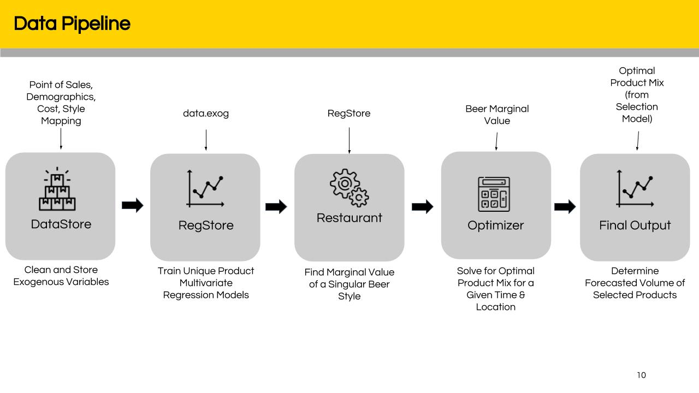

# SeniorDesign
Senior Design Repository for Analysis, Visualizations

# Purpose
The purpose of this repo is to take BWW Sales, Costs, Demographic, Restaurant, and Beer Segment data to forecast monthly mandates for beers on tap. We will deliver this through internally developed python classes separated by functionality. See class list below:



## Class List:

### DataStore
DataStore will clean initial POS, Restaurant, and Cost data and convert the initial csv files to panda dataframes.
```
import mtop.datastore as ds
data = ds.DataStore()
```
#### Load User generated files
```
data.load_sales("../data/Georgia_POS.csv")
data.load_sports("../data/SportsData.csv")
data.load_beer_styles("../data/Beer_Style_Mapping.csv")
data.load_costs("../data/Mapped_KegCosts2019.xlsx")
```
#### Aggregate data 
```
data.group_data("Month")
```
#### Load exogenous variables for training
```
data.load_exog()
```
#### Get the base plan beers
```
data.get_baseplan()
```
#### Separate top performers and mid/low performers
```
data.separate_exog()
```

#### Important Attributes
- data.exog: a dataframe of all aggregated and clean data
- data.base_exog: the exog dataframe of base plan beers
- data.style_exog: the exog dataframe of mid to low performing beers
- data.base_plan: list of baseplan beers

### RegStore
RegStore will generate regression outputs from the panda dataframes created by DataStore.
```
import mtop.regstore as rs
RS = rs.RegStore()
```
#### build OLS models
```
RS.build_models(data)
```

### Restaurant
Restaurant class will take in the regression and computes the marginal value (profit) for any given beer at any given location at any given time.
```
import mtop.restaurant as restaurant
for restnum in list_of_restaurants:
  R = restaurant.Restaurant(data,RS,restnum)
  R.gen_promo() 
  R.build_proxys(num_beers,)
  R.get_profits()
```

### Optimizer
Optimizer will hold the optimization model including indexable sets, variables, constraints, objectives etc. It will take in marginal values from DataStore, promotional data, and restaurant information. It should also allow for dynamic solves allowing the user to change constraints and objectives. 
```
import mtop.optimizer as optimizer
opt = optimizer.Optimizer(restaurant, tap_capacities[restaurant], profit_dict[month], beer_map, data.base_plan, beerr_promo_input)
opt.gen_results_list()
```

#### Generate solver object
```
opt = pyo.SolverFactory('cbc')  # Select solver
solver_manager = pyo.SolverManagerFactory('neos')
results = solver_manager.solve(self.model, opt=opt)
```

#### Get organized results list
```
out = list(opt.mandate_list.items())
out.sort(key=lambda x: (x[0][0], x[0][1]))
```
